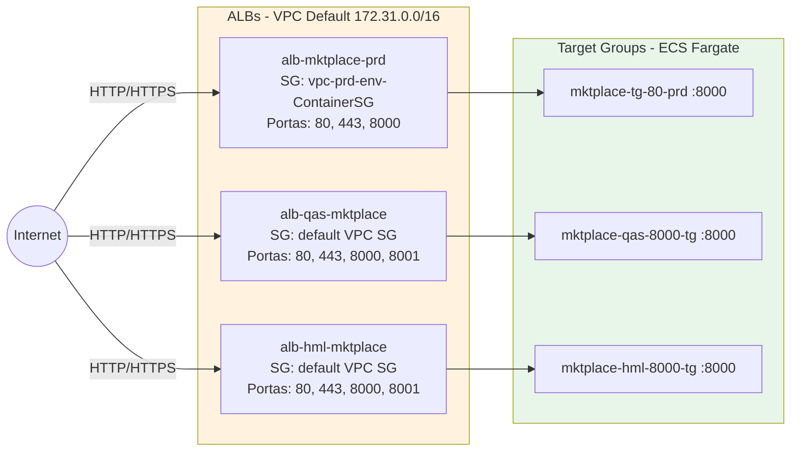
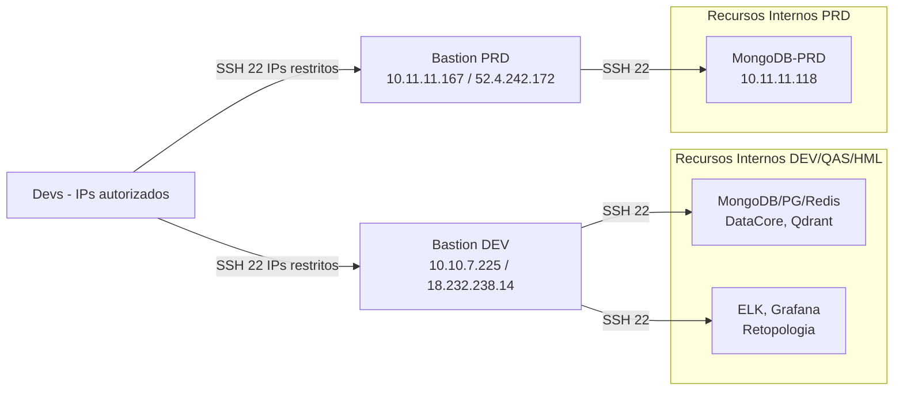
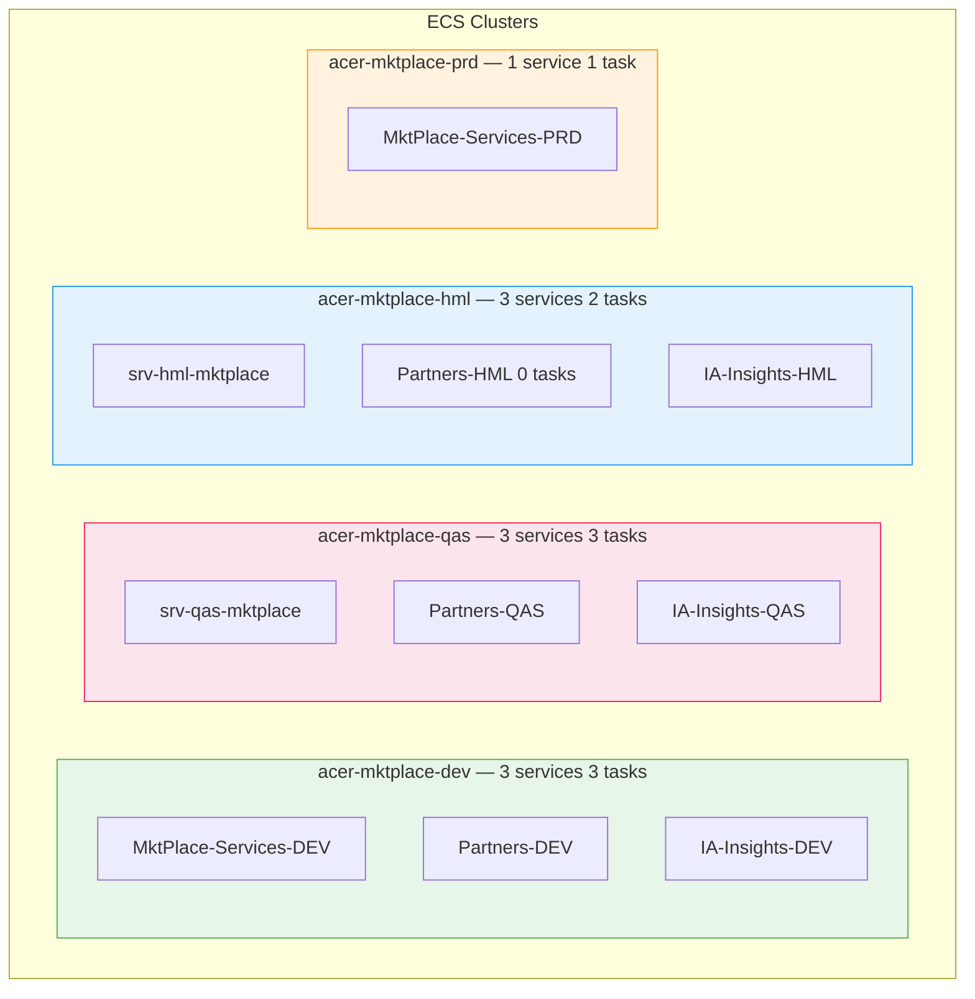

# Relatório de Arquitetura de Redes e Segurança AWS

> **Conta:** 089439724840 | **Região:** us-east-1 | **Data:** 10/04/2026 | **Perfil:** default

Este documento apresenta uma análise detalhada da infraestrutura de rede da conta AWS **089439724840**, mapeada em **10 de abril de 2026**. O objetivo é fornecer uma visão clara sobre a organização das VPCs, exposição de serviços à internet, conformidade de segurança e recomendações de remediação.

---

## Sumário

| Indicador | Valor |
|---|---|
| VPCs | 5 (4 customizadas + 1 default) |
| Subnets | 28 (15 públicas, 13 privadas) |
| Instâncias EC2 | 16 (11 running, 5 stopped) |
| ECS Clusters | 4 (DEV, QAS, HML, PRD) |
| ECS Services ativos | 10 |
| Lambda em VPC | 2 |
| ALBs (via ENI) | 3 (alb-hml-mktplace, alb-qas-mktplace, alb-mktplace-prd) |
| NAT Gateways | 4 |
| Elastic IPs | 26 (17 sem tag Name) |
| IPs públicos em EC2 | 8 |

---

## 1. Visão Geral da Infraestrutura

A infraestrutura está concentrada na região **us-east-1** e organizada em ambientes distintos (Produção, Homologação, QA e Desenvolvimento), cada um com sua própria VPC dedicada para isolamento de recursos.

### 1.1 Resumo de VPCs

| VPC (Tag Name) | ID | CIDR | Finalidade | IGW | NAT | Subnets Pub | Subnets Priv |
|---|---|---|---|---|---|---|---|
| `vpc-dev-qas-hml-env` | `vpc-05d32b88bae18183b` | `10.10.0.0/16` | DEV / QAS / HML | ✅ | ✅ `54.224.175.233` | 3 | 3 |
| `vpc-prd-env-vpc` | `vpc-08326fbf152e402d5` | `10.11.0.0/16` | Produção | ✅ | ✅ `54.224.144.171` | 2 | 2 |
| `vpc-hml-env` | `vpc-0540753e6e334a662` | `10.12.0.0/16` | Homologação | ✅ | ✅ `54.211.144.200` | 2 | 4 |
| `vpc-qas-env` | `vpc-03958a9f0b439716a` | `10.20.0.0/16` | Quality Assurance | ✅ | ✅ `44.209.18.174` | 2 | 4 |
| `default` | `vpc-0650fbe4db4a34490` | `172.31.0.0/16` | VPC Padrão da AWS | ✅ | ❌ | 6 | 0 |

> **Observação importante:** Os ALBs (alb-hml-mktplace, alb-qas-mktplace, alb-mktplace-prd) estão na **VPC Default** (172.31.0.0/16) e não nas VPCs de ambiente. O tráfego chega nos ALBs na VPC Default e é roteado para os Target Groups do ECS nas VPCs de ambiente.
>
> **Atenção:** Na VPC DEV, a subnet `vpc-dev-env - Database (AZ1)` (10.10.32.0/20) possui rota para o Internet Gateway, sendo classificada como **pública**. As instâncias de banco de dados nessa subnet (MongoDB, DataCore, Qdrant) estão em subnet pública, o que agrava o risco das regras de SG abertas para 0.0.0.0/0.

### 1.2 Topologia de Rede

```mermaid
graph TB
    INTERNET((Internet))

    subgraph AWS_ACCOUNT["AWS Account 089439724840 — us-east-1"]

        subgraph VPC_DEFAULT["VPC Default — 172.31.0.0/16"]
            direction LR
            ALB_HML["ALB alb-hml-mktplace"]
            ALB_QAS["ALB alb-qas-mktplace"]
            ALB_PRD["ALB alb-mktplace-prd"]
        end

        subgraph VPC_DEV["VPC DEV/QAS/HML — 10.10.0.0/16"]
            direction TB
            subgraph DEV_GW["Gateways"]
                direction LR
                IGW_DEV["IGW vpc-dev-env-igw"]
                NAT_DEV["NAT 54.224.175.233"]
            end

            subgraph DEV_PUB["Subnets Públicas"]
                direction LR
                BASTION_DEV["BastionHost-DEV\n10.10.7.225 / 18.232.238.14"]
                ELK_DEV["ELK-DEV\n10.10.1.89 / 34.199.152.100"]
                ELK_QAS["ELK-QAS\n10.10.9.216 / 98.89.249.154"]
                GRAFANA["Grafana\n10.10.1.234 / 3.226.96.194"]
                RETO_PRD["Retopologia-PRD\n10.10.27.209 / 34.193.21.173"]
            end

            subgraph DEV_MS["Subnets Microservices - Privadas"]
                direction LR
                ECS_DEV["ECS acer-mktplace-dev\n3 services"]
                ECS_QAS["ECS acer-mktplace-qas\n3 services"]
                ECS_HML["ECS acer-mktplace-hml\n3 services"]
                LAMBDA1["Lambda product-partner-dev"]
                LAMBDA2["Lambda 3d-retopology-dev"]
            end

            subgraph DEV_DB["Subnets Database - Privadas"]
                direction LR
                MONGO_DEV["MongoDB-DEV stopped"]
                MONGO_HML["MongoDB-HML"]
                MONGO_QAS["MongoDB-QAS stopped"]
                DATACORE_DEV["DataCore-DEV"]
                DATACORE_QAS["DataCore-QAS stopped"]
                QDRANT_DEV["Qdrant-DEV stopped"]
                QDRANT_QAS["Qdrant-QAS stopped"]
            end
        end

        subgraph VPC_PRD["VPC PRD — 10.11.0.0/16"]
            direction TB
            subgraph PRD_GW["Gateways"]
                direction LR
                IGW_PRD["IGW vpc-prd-env-igw"]
                NAT_PRD["NAT 54.224.144.171"]
            end

            subgraph PRD_PUB["Subnets Públicas"]
                direction LR
                BASTION_PRD["BastionHost-PRD\n10.11.11.167 / 52.4.242.172"]
                MONGO_PRD_I["MongoDB-PRD\n10.11.11.118"]
            end

            subgraph PRD_PRIV["Subnets Privadas"]
                ECS_PRD["ECS acer-mktplace-prd\n1 service"]
            end
        end

        subgraph VPC_HML["VPC HML — 10.12.0.0/16 — sem workloads ECS"]
            direction LR
            IGW_HML["IGW vpc-hml-env-igw"]
            NAT_HML["NAT 54.211.144.200"]
        end

        subgraph VPC_QAS["VPC QAS — 10.20.0.0/16 — sem workloads ECS"]
            direction LR
            IGW_QAS["IGW vpc-qas-env-igw"]
            NAT_QAS["NAT 44.209.18.174"]
        end
    end

    INTERNET --> ALB_HML
    INTERNET --> ALB_QAS
    INTERNET --> ALB_PRD
    INTERNET --> IGW_DEV
    INTERNET --> IGW_PRD

    ALB_HML -.->|Target Groups| ECS_HML
    ALB_QAS -.->|Target Groups| ECS_QAS
    ALB_PRD -.->|Target Groups| ECS_PRD

    IGW_DEV --> BASTION_DEV
    IGW_DEV --> ELK_DEV
    IGW_DEV --> ELK_QAS
    IGW_DEV --> GRAFANA
    IGW_DEV --> RETO_PRD
    IGW_PRD --> BASTION_PRD

    NAT_DEV --> DEV_MS
    NAT_DEV --> DEV_DB
    NAT_PRD --> PRD_PRIV

    BASTION_DEV -.->|SSH 22| DEV_DB
    BASTION_PRD -.->|SSH 22| MONGO_PRD_I

    style VPC_DEFAULT fill:#f5f5f5,stroke:#999,color:#333
    style VPC_DEV fill:#e8f5e9,stroke:#4caf50,color:#333
    style VPC_PRD fill:#fff3e0,stroke:#ff9800,color:#333
    style VPC_HML fill:#e3f2fd,stroke:#2196f3,color:#333
    style VPC_QAS fill:#fce4ec,stroke:#e91e63,color:#333
    style DEV_GW fill:#e8f5e9,stroke:#81c784,color:#333
    style PRD_GW fill:#fff3e0,stroke:#ffb74d,color:#333
```

### 1.3 Diagrama de Arquitetura — Fluxo de Tráfego e Organização dos Ambientes

```mermaid
flowchart TB
    INTERNET(("Internet"))

    subgraph AWS["AWS Cloud — us-east-1 — Conta 089439724840"]

        subgraph VPC_DEFAULT["VPC Default — 172.31.0.0/16"]
            direction LR
            ALB_PRD["ALB alb-mktplace-prd\n80, 443, 8000"]
            ALB_QAS["ALB alb-qas-mktplace\n80, 443, 8000, 8001"]
            ALB_HML["ALB alb-hml-mktplace\n80, 443, 8000, 8001"]
        end

        subgraph VPC_PRD["VPC Produção — 10.11.0.0/16"]
            direction TB
            subgraph PRD_GW2["Gateways PRD"]
                direction LR
                IGW_PRD["Internet Gateway"]
                NAT_PRD["NAT Gateway 54.224.144.171"]
            end
            subgraph PRD_PUB["Subnet Pública"]
                direction LR
                BASTION_PRD["EC2: BastionHost-PRD\nt2.nano | 10.11.11.167 / 52.4.242.172"]
            end
            subgraph PRD_PRIV["Subnet Privada"]
                direction LR
                ECS_PRD["ECS: MktPlace-Services-PRD\nFargate 1 task\napi:8000 vtex:8001 product:8002\nanymarket:8005 notification:8006\ncisp1:8007 stock-sync:8008"]
                MONGO_PRD["EC2: MongoDB-PRD\nt3.medium | 10.11.11.118"]
            end
        end

        subgraph VPC_DEV["VPC Dev/QAS/HML — 10.10.0.0/16"]
            direction TB
            subgraph DEV_GW2["Gateways DEV"]
                direction LR
                IGW_DEV["Internet Gateway"]
                NAT_DEV["NAT Gateway 54.224.175.233"]
            end
            subgraph DEV_PUB["Subnets Públicas"]
                direction LR
                BASTION_DEV["EC2: BastionHost-DEV\nt2.nano | 10.10.7.225 / 18.232.238.14"]
                ELK_DEV["EC2: ELK-DEV\nc6g.xlarge | 10.10.1.89 / 34.199.152.100"]
                ELK_QAS["EC2: ELK-QAS\nc6g.xlarge | 10.10.9.216 / 98.89.249.154"]
                GRAFANA["EC2: Grafana\nt4g.small | 10.10.1.234 / 3.226.96.194"]
                RETO_PRD["EC2: Retopologia-PRD\nm6a.xlarge | 10.10.27.209 / 34.193.21.173"]
            end
            subgraph DEV_MS["Subnets Microservices Privadas — ECS DEV/QAS/HML"]
                direction LR
                ECS_DEV["ECS: acer-mktplace-dev\n3 services 3 tasks\nMktPlace Partners IA-Insights"]
                ECS_QAS["ECS: acer-mktplace-qas\n3 services 3 tasks\nsrv-qas Partners IA-Insights"]
                ECS_HML["ECS: acer-mktplace-hml\n3 services 2 tasks\nsrv-hml Partners IA-Insights"]
                LAMBDA1["Lambda product-partner-dev"]
                LAMBDA2["Lambda 3d-retopology-dev"]
            end
            subgraph DEV_DB["Subnets Database Privadas"]
                direction LR
                MONGO_HML["MongoDB-HML\n10.10.49.92"]
                MONGO_DEV_S["MongoDB-DEV stopped\n10.10.49.88"]
                MONGO_QAS_S["MongoDB-QAS stopped\n10.10.49.91"]
                DATACORE_DEV["DataCore-DEV PG\n10.10.58.237"]
                DATACORE_QAS_S["DataCore-QAS stopped\n10.10.54.151"]
                QDRANT_DEV_S["Qdrant-DEV stopped\n10.10.50.82"]
                QDRANT_QAS_S["Qdrant-QAS stopped\n10.10.48.47"]
                RETO_DEV_S["Reto-DEV stopped\n10.10.16.10"]
                RETO_GPU_S["Reto-GPU stopped\n10.10.19.197"]
            end
        end

        subgraph VPC_HML["VPC Homologação — 10.12.0.0/16 — Sem workloads ativos"]
            direction LR
            IGW_HML["Internet Gateway"]
            NAT_HML["NAT Gateway 54.211.144.200"]
            HML_PRIV["Subnets Privadas 4 - Sem recursos"]
        end

        subgraph VPC_QAS["VPC QA — 10.20.0.0/16 — Sem workloads ativos"]
            direction LR
            IGW_QAS["Internet Gateway"]
            NAT_QAS["NAT Gateway 44.209.18.174"]
            QAS_PRIV["Subnets Privadas 4 - Sem recursos"]
        end

    end

    INTERNET -->|HTTP/HTTPS| VPC_DEFAULT
    INTERNET -->|SSH Bastion| IGW_PRD
    INTERNET -->|SSH + Servicos| IGW_DEV

    ALB_PRD -.->|"TG :8000 :8002"| ECS_PRD
    ALB_QAS -.->|"TG :8000 :8002"| ECS_QAS
    ALB_HML -.->|"TG :8000 :8002"| ECS_HML

    BASTION_DEV -.->|SSH 22| DEV_DB
    BASTION_PRD -.->|SSH 22| MONGO_PRD

    DEV_MS -->|Saida via NAT| NAT_DEV
    DEV_DB -->|Saida via NAT| NAT_DEV
    PRD_PRIV -->|Saida via NAT| NAT_PRD

    style VPC_DEFAULT fill:#f5f5f5,stroke:#999,stroke-width:2px,color:#333
    style VPC_PRD fill:#fff3e0,stroke:#ff9800,stroke-width:2px,color:#333
    style VPC_DEV fill:#e8f5e9,stroke:#4caf50,stroke-width:2px,color:#333
    style VPC_HML fill:#e3f2fd,stroke:#90caf9,stroke-width:1px,stroke-dasharray:5 5,color:#333
    style VPC_QAS fill:#fce4ec,stroke:#ef9a9a,stroke-width:1px,stroke-dasharray:5 5,color:#333
    style INTERNET fill:#f06292,stroke:#c2185b,color:#333
    style DEV_DB fill:#fff9c4,stroke:#f9a825,color:#333
    style PRD_PRIV fill:#fff9c4,stroke:#f9a825,color:#333
    style DEV_MS fill:#e1f5fe,stroke:#0288d1,color:#333
    style DEV_GW2 fill:#e8f5e9,stroke:#81c784,color:#333
    style PRD_GW2 fill:#fff3e0,stroke:#ffb74d,color:#333
```

#### Legenda do Diagrama

| Símbolo | Significado |
|---|---|
| 🔀 | Application Load Balancer |
| 🌐 | Internet Gateway |
| 🔄 | NAT Gateway |
| 🖥️ | Instância EC2 |
| 📦 | ECS Cluster / Service (Fargate) |
| 🗄️ | Banco de Dados (EC2) |
| λ | AWS Lambda |
| ⏸️ | Instância Stopped |
| ⚠️ | VPC sem workloads ativos |
| `──▶` (sólida) | Tráfego de rede ativo |
| `╌╌▶` (tracejada) | Roteamento via Target Groups / SSH |

---

## 2. Conectividade e Exposição à Internet

A arquitetura utiliza uma combinação de **Internet Gateways (IGW)** para tráfego público e **NAT Gateways** para permitir que recursos em subnets privadas acessem a internet de forma segura.

### 2.1 Pontos de Exposição (Internet Gateways)

Todas as 5 VPCs possuem um IGW associado, indicando que possuem subnets públicas capazes de receber tráfego externo direto ou via Load Balancers.

### 2.2 Saída de Dados (NAT Gateways)

| VPC | IP Público do NAT | Subnet de Origem |
|---|---|---|
| Produção (10.11.0.0/16) | `54.224.144.171` | `subnet-0a038fb91a77e8c64` |
| Homologação (10.12.0.0/16) | `54.211.144.200` | `subnet-02e6c7341d7b270fb` |
| QA (10.20.0.0/16) | `44.209.18.174` | `subnet-0a4e477f6c82e4579` |
| Desenvolvimento (10.10.0.0/16) | `54.224.175.233` | `subnet-0fdabfb3d6f9e663c` |

> A VPC Default (172.31.0.0/16) **não possui NAT Gateway** — todos os recursos nela são públicos por padrão.

### 2.3 Fluxo de Acesso — Internet → Serviços ECS

### 2.4 Fluxo SSH (Acesso Administrativo)

---

## 3. Serviços e Cargas de Trabalho

### 3.1 Instâncias EC2 — Running (11)

| Nome | Tipo | VPC | IP Privado | IP Público | SG | Função |
|---|---|---|---|---|---|---|
| BastionHost-DEV-QAS-HML | t2.nano | DEV | `10.10.7.225` | `18.232.238.14` | vpc-dev-env-sg-SSH | Jump box DEV/QAS/HML |
| BastionHost-PRD | t2.nano | PRD | `10.11.11.167` | `52.4.242.172` | vpc-prd-env-sg-SSH | Jump box PRD |
| MongoDB-PRD | t3.medium | PRD | `10.11.11.118` | — | MongoDB-PRD-sg | BD MongoDB produção |
| MongoDB-HML | t3.micro | DEV | `10.10.49.92` | — | MongoDB-DEV | BD MongoDB homologação |
| ELK-DEV | c6g.xlarge | DEV | `10.10.1.89` | `34.199.152.100` | elk-dev-sg | Elasticsearch/Logstash/Kibana |
| ELK-QAS | c6g.xlarge | DEV | `10.10.9.216` | `98.89.249.154` | elk-dev-sg | Elasticsearch/Logstash/Kibana |
| DataCore-DEV | t4g.micro | DEV | `10.10.58.237` | — | data-core-sg | PostgreSQL DEV |
| Grafana-Service | t4g.small | DEV | `10.10.1.234` | `3.226.96.194` | grafana-sg | Monitoramento / Dashboards |
| Retopologia-Service-PRD | m6a.xlarge | DEV | `10.10.27.209` | `34.193.21.173` | reto-backend-sg | Serviço de retopologia 3D |
| Retopologia-Service-DEV | m6a.xlarge | DEV | `10.10.16.10` | `34.235.101.179` | reto-backend-sg | Retopologia 3D DEV |
| Retopologia-Service-GPU-DEV-New | gr6.4xlarge | DEV | `10.10.19.197` | `3.233.26.196` | reto-backend-sg | GPU Retopologia DEV |

### 3.2 Instâncias EC2 — Stopped (5)

| Nome | Tipo | VPC | IP Privado | SG | Função |
|---|---|---|---|---|---|
| MongoDB-DEV | t2.micro | DEV | `10.10.49.88` | MongoDB-DEV | BD MongoDB DEV |
| MongoDB-QAS | t3.micro | DEV | `10.10.49.91` | MongoDB-DEV | BD MongoDB QAS |
| Data-Qdrant-DEV | t3.small | DEV | `10.10.50.82` | Data-Qdrant-DEV-sg | Vector DB DEV |
| Data-Qdrant-QAS | t3.small | DEV | `10.10.48.47` | Data-Qdrant-DEV-sg | Vector DB QAS |
| DataCore-QAS | t4g.micro | DEV | `10.10.54.151` | data-core-sg | PostgreSQL QAS |

### 3.3 Clusters ECS (Containers)

Todos os serviços rodam em **Fargate**. Os clusters DEV, QAS e HML utilizam subnets da **VPC DEV (10.10.0.0/16)**. Apenas o cluster PRD roda na VPC PRD (10.11.0.0/16).

#### Serviços Ativos

| Cluster | Serviço | Launch Type | Subnets (VPC) | SG | IP Público |
|---|---|---|---|---|---|
| `acer-mktplace-prd` | MktPlace-Services-PRD | FARGATE | Private AZ1+AZ2 (PRD) | vpc-prd-env-ContainerSG | **ENABLED** ⚠️ |
| `acer-mktplace-hml` | srv-hml-mktplace | FARGATE | Microservices AZ1+AZ2 (DEV) | vpc-dev-env-ContainerSG | DISABLED |
| `acer-mktplace-hml` | Partners-HML (0 tasks) | FARGATE | Microservices AZ1+AZ2 (DEV) | vpc-dev-env-ContainerSG | DISABLED |
| `acer-mktplace-hml` | IA-Insights-HML | FARGATE + SPOT | Microservices AZ1+AZ2 (DEV) | vpc-dev-env-ContainerSG | **ENABLED** ⚠️ |
| `acer-mktplace-qas` | srv-qas-mktplace | FARGATE | Microservices AZ1+AZ2 (DEV) | vpc-dev-env-ContainerSG | DISABLED |
| `acer-mktplace-qas` | Partners-QAS | FARGATE | Microservices AZ1+AZ2 (DEV) | vpc-dev-env-ContainerSG | DISABLED |
| `acer-mktplace-qas` | IA-Insights-QAS | FARGATE + SPOT | Microservices AZ1+AZ2 (DEV) | vpc-dev-env-ContainerSG | **ENABLED** ⚠️ |
| `acer-mktplace-dev` | MktPlace-Services-DEV | FARGATE | Microservices AZ1+AZ2 (DEV) | vpc-dev-env-ContainerSG | DISABLED |
| `acer-mktplace-dev` | Partners-DEV | FARGATE | Microservices AZ1+AZ2 (DEV) | vpc-dev-env-ContainerSG | DISABLED |
| `acer-mktplace-dev` | IA-Insights-DEV | FARGATE + SPOT | Microservices AZ1+AZ2 (DEV) | vpc-dev-env-ContainerSG | **ENABLED** ⚠️ |

#### Port Mappings — Microsserviços

| Container | Porta | Protocolo | Presente em | Target Group |
|---|---|---|---|---|
| **api** (ms-backend-bff) | 8000 | tcp | DEV, QAS, HML, PRD | mktplace-{env}-8000-tg |
| **vtex** (ms-vtex) | 8001 | tcp | DEV, QAS, HML, PRD | — |
| **product** (ms-product) | 8002 | tcp | DEV, QAS, HML, PRD | mktplace-{env}-8002-tg |
| **anymarket** (ms-anymarket) | 8005 | tcp | DEV, QAS, HML, PRD | — |
| **notification** (ms-notification) | 8006 | tcp | DEV, QAS, HML, PRD | — |
| **cisp1** (ms-cisp1) | 8007 | tcp | DEV, QAS, HML, PRD | — |
| **stock-sync** (ms-stock-sync) | 8008 | tcp | PRD | — |
| **product-v2** (ms-product-v2) | 8010 | tcp | DEV | mktplace-dev-8010-tg |
| **ia-insights** (ms-ia-insights) | 8000 | tcp | DEV, QAS, HML | ia-insights-{env}-8000-tg |
| **backend-partners** | 8000 | tcp | DEV, QAS, HML | mktplace-partners-{env}-8000-tg |

### 3.4 Lambda em VPC

| Função | Runtime | VPC | Subnets | SG |
|---|---|---|---|---|
| product-partner-dev | python3.14 | DEV (10.10.0.0/16) | Microservices AZ1+AZ2 | default DEV SG |
| 3d-retopology-dev | python3.14 | DEV (10.10.0.0/16) | Microservices AZ1+AZ2 | default DEV SG |

### 3.5 Elastic IPs

| Total | Associados a EC2 | Associados a ENI (ALB/NAT/ECS) | Sem tag Name |
|---|---|---|---|
| 26 | 8 | 18 | 17 |

> 17 dos 26 EIPs não possuem tag Name — considerar nomeá-los para rastreabilidade.

---

## 4. Mapa de Exposição à Internet

### 4.1 IPs Públicos em Instâncias EC2

| Instância | IP Público | Portas Expostas ao 0.0.0.0/0 | Risco |
|---|---|---|---|
| BastionHost-DEV | `18.232.238.14` | SSH 22 (IPs restritos) | ✅ Adequado |
| BastionHost-PRD | `52.4.242.172` | SSH 22 (IPs restritos) | ✅ Adequado |
| ELK-DEV | `34.199.152.100` | 5044, 5601, 9200, 9300, 9600 | 🔴 **Elastic/Kibana público** |
| ELK-QAS | `98.89.249.154` | 5044, 5601, 9200, 9300, 9600 | 🔴 **Elastic/Kibana público** |
| Grafana | `3.226.96.194` | 3000 (sem source), 3100 (restrito) | 🟡 Revisar acesso 3000 |
| Retopologia-PRD | `34.193.21.173` | 5000-5002 (0.0.0.0/0) | 🟡 API pública |
| Retopologia-DEV (stopped) | `34.235.101.179` | 5000-5002 (0.0.0.0/0) | 🟡 API pública |
| Reto-GPU-DEV (stopped) | `3.233.26.196` | 5000-5002 (0.0.0.0/0) | 🟡 API pública |

### 4.2 Portas Expostas via ALBs (VPC Default)

| ALB | SG | Portas de Entrada | Destino |
|---|---|---|---|
| alb-mktplace-prd | vpc-prd-env-ContainerSG | 80, 443, 8000 | ECS PRD |
| alb-qas-mktplace | default VPC SG | 80, 443, 8000, 8001 | ECS QAS |
| alb-hml-mktplace | default VPC SG | 80, 443, 8000, 8001 | ECS HML/DEV |

### 4.3 Portas de Serviços Internos Expostas Publicamente

| Serviço | Porta | SG | Aberto para | Instâncias usando |
|---|---|---|---|---|
| MongoDB | 27017 | MongoDB-DEV | **0.0.0.0/0** 🔴 | MongoDB-DEV, MongoDB-HML, MongoDB-QAS |
| MongoDB | 27017 | MongoDB-PRD-sg | **0.0.0.0/0** 🔴 | MongoDB-PRD |
| MongoDB | 27017 | MongoDB-QAS | **0.0.0.0/0** 🔴 | — |
| MongoDB | 27017 | data-core-prd-sg | **0.0.0.0/0** 🔴 | — |
| MongoDB | 27017 | data-core-dev-sg | **0.0.0.0/0** 🔴 | DataCore-DEV, DataCore-QAS |
| PostgreSQL | 5432 | data-core-sg | **0.0.0.0/0** 🔴 | DataCore-DEV, DataCore-QAS |
| PostgreSQL | 5432 | data-core-prd-sg | **0.0.0.0/0** 🔴 | — |
| PostgreSQL | 5432 | data-core-dev-sg | **0.0.0.0/0** 🔴 | DataCore-DEV, DataCore-QAS |
| Redis | 6379 | MongoDB-DEV | **0.0.0.0/0** 🔴 | MongoDB-DEV, MongoDB-HML, MongoDB-QAS |
| Redis | 6379 | data-core-prd-sg | **0.0.0.0/0** 🔴 | — |
| Redis | 6379 | data-core-dev-sg | **0.0.0.0/0** 🔴 | DataCore-DEV, DataCore-QAS |
| Elasticsearch | 9200/9300 | elk-dev-sg | **0.0.0.0/0** 🟡 | ELK-DEV, ELK-QAS |
| Kibana | 5601 | elk-dev-sg | **0.0.0.0/0** 🟡 | ELK-DEV, ELK-QAS |
| Qdrant | 6333/6334 | Data-Qdrant-DEV-sg | **0.0.0.0/0** 🟡 | Qdrant-DEV, Qdrant-QAS |
| SSH | 22 | MongoDB-QAS | **0.0.0.0/0** 🔴 | — |
| SSH | 22 | MongoDB-DEV | **0.0.0.0/0** 🔴 | MongoDB-DEV, MongoDB-HML, MongoDB-QAS |
| SSH | 22 | data-core-sg | **0.0.0.0/0** 🔴 | DataCore-DEV, DataCore-QAS |

---

*Relatório gerado automaticamente a partir de dados coletados via AWS CLI em 10/04/2026 e revisado manualmente.*
